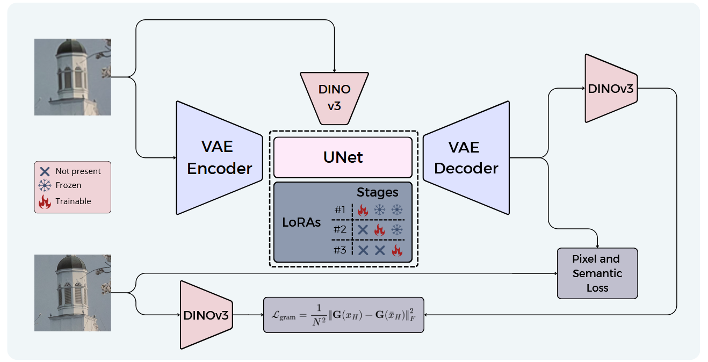

<div align="center">
  <h1> GramSR: Visual Feature Conditioning for
Diffusion-Based Super-Resolution </h1>
</div>

<div align="center">
  
</div>

<p align="center">
<a href='https://arxiv.org/abs/2604.2545'></a>
</p>
## 📢 Latest Updates
  - [2026/05/11] 🤗 Inference code and **weights** release

## Overview




GramSR is a one-step diffusion-based real-world image super-resolution framework built on Stable Diffusion. Unlike previous methods relying on text-based conditioning, GramSR leverages dense visual features extracted from the low-resolution input using a pre-trained DINOv3 encoder, enabling stronger spatial alignment and more faithful restoration.

The framework adopts a three-stage LoRA training strategy:
- **Pixel-level LoRA** for degradation removal
- **Semantic-level LoRA** for perceptual enhancement
- **Texture-level LoRA** for texture consistency via Gram matrix supervision

At inference time, independent guidance scales provide flexible control over restoration quality, semantic enhancement, and texture preservation.

## Table of Contents

- [Environment Setup](#environment-setup)
- [Inference](#inference)
- [Outputs](#outputs)
- [Citation](#citation)


## Environment Setup

### 1) Create the environment

```bash
# Clone repository
git clone https://github.com/aimagelab/GramSR.git
cd GramSR

# Create virtual environment
python3.11 -m venv .venv
source .venv/bin/activate

# Upgrade pip
python -m pip install --upgrade pip

# Install PyTorch with CUDA 12.1 support
pip install torch torchvision torchaudio --index-url https://download.pytorch.org/whl/cu121

# Install remaining dependencies
pip install -r requirements.txt
````


If you use `conda`, you can install the packages from [requirements.txt](requirements.txt) in an activated conda environment.

### 2) Models & weights
- Stable Diffusion 2.1 weights (required): download the Stable Diffusion 2.1 model weights and provide their folder path as `--pretrained_model_path` when running the scripts.
- The DINO embedder in the code defaults to the HF model id `facebook/dinov3-vitb16-pretrain-lvd1689m` and will be downloaded automatically if not present in the local cache.
- LoRA adapters and other checkpoints are read from the  `weights/checkpoints` directory in the repo; filenames in use by the code follow the pattern used in `weights/checkpoints` (e.g. `adapter_53001.pth`, `model_12501.pkl`). The files `adapter_53001.pth` and `lora_weights_dino_53001.safetensors` are already included in the repository. However, `model_12501.pkl` is not hosted on GitHub because it exceeds the file size limit (25 MB). It must be downloaded separately from the provided external link and placed into `weights/checkpoints/`. Save any checkpoints you download from the provided link into `weights/checkpoints/` so the code can find them.


## Quick Inference

```bash
python inference.py \
  --pretrained_model_path /path/to/sd2.1_model \
  --lora_dir ./weights/checkpoints \
  --output_dir output/pred
```


## Citation

If you use this code, please cite our ICPR 2026 paper:

```bibtex
@inproceedings{fdoronzio2026gramsr,
  title={{GramSR: Visual Feature Conditioning for Diffusion-Based Super-Resolution}},
  author={D'Oronzio, Fabio and Putamorsi, Federico and Zini, Leonardo and Cornia, Marcella and Baraldi, Lorenzo},
  booktitle={International Conference on Pattern Recognition},
  year={2026}
}
```
